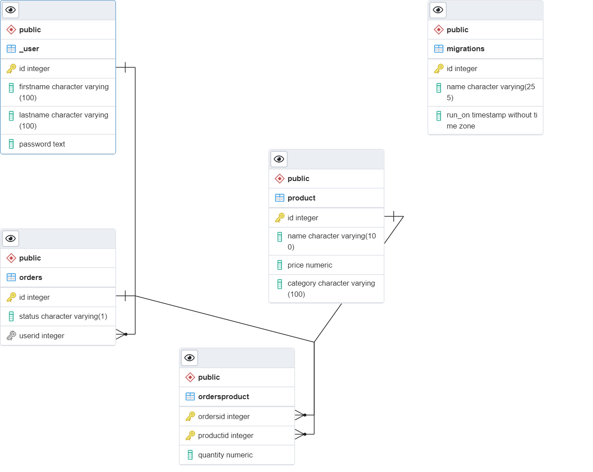

# API Requirements
The company stakeholders want to create an online storefront to showcase their great product ideas. Users need to be able to browse an index of all products, see the specifics of a single product, and add products to an order that they can view in a cart page. You have been tasked with building the API that will support this application, and your coworker is building the frontend.

These are the notes from a meeting with the frontend developer that describe what endpoints the API needs to supply, as well as data shapes the frontend and backend have agreed meet the requirements of the application. 

## API Endpoints
#### Products                                       | endpoints
- Index                                             |[get]/Product/
- Show (args: product id)                           |[get]/Product/:id
- Create (args: Product)[token required]            |[post]/Product/
- [OPTIONAL] Top 5 most popular products            |[get]/Product/topfive
- [OPTIONAL] Products by category (args: product category) |[get]/Product/category/:categotyName

#### Users
- Index [token required]   [get]/user/
- Show (args: id)[token required]  [get]/user/:id
- Create (args: User)   [post]/user/
- login (args: {userId:string,password:string})   [post]/user/login

#### Orders
- Current Order by user (args: user id)[token required] [get]/orders/
- [OPTIONAL] Completed Orders by user (args: user id)[token required] [get]/orders/Completed

## Data Shapes
#### Product
-  id  
- name
- price
- [OPTIONAL] category

#### User
- id
- firstName
- lastName
- password

#### Orders
- id
- id of each product in the order
- quantity of each product in the order
- user_id
- status of order (active or complete)

## the endpoints

| endpoint                                  | what's it doing ? |body json shape    |
| :----------------- | :-------------------- |:-----|
| [get]/                                         | show hello massage   |   |
| [get]/user/                         | get all users [token required]     ||
| [post]/user/                         | create a new user    | {firstname: "mostafa",lastname: "safwat",password: "123"} |
| [get]/user/i            | get the user that have id=(i) [token required]  ||
| [post]/user/login                         | login user py id and password   |{ userId: "1",   password: "password"}|
| [get]/product/                         | get all products      ||
| [post]/product/     | create a new product [token required]     |{ name: "pc", price: 20, category: "hw" }|
| [get]/product/topfive    | get the top five most popular products    ||
| [get]/Product/category/:categotyName|  get all Products in the category  ||
| [get]/Product/i            | get the Product that have id=(i)   ||
| [get]/orders/ | get all order data of the signed users [token required]   ||
| [get]/orders/Completed | get all order data of the signed users which is Completed [token required]     ||
| any other paths                           | response html page with 404 not found            ||


## Databse schema 
###tebles
- _User
- Product
- Orders
- OrdersProduct
### ERD 

### date types
#### Product
```sql
id  integer
name varchar(100)
price numeric
category varchar(100) 
```

#### _User
```sql
id  integer
firstName varchar(100)
lastName varchar(100)
password text
```

#### Orders
```sql
id integer 
status varchar(1) 
userid integer
```
#### OrdersProduct
```sql
ordersid integer 
productid integer
quantity numeric DEFAULT 1.0
```
### schema
> see migrations files